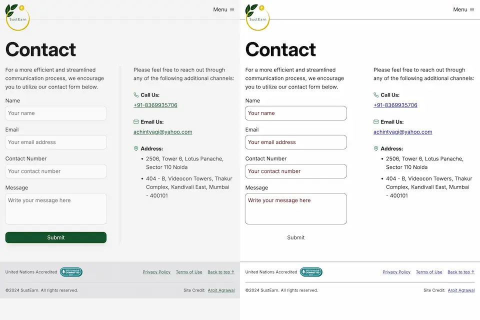

## For accessibility in high contrast mode

In [high contrast mode](/blog/testing-in-forced-colors-mode), removing the default border of an interactive element like a button by using `border: none` could cause the button to appear as floating text on the page.

<!--rehype:loading=eager-->

[Dave Rupert](https://frontendmasters.com/blog/you-want-border-color-transparent-not-border-none/) explains the purpose of the default border:

> In the case of interactive form controls (inputs, textareas, buttons, etc.), those pesky borders were put there because they have an accessibility benefit when using High Contrast Mode, a feature [used by 30.6% of low-vision users](https://webaim.org/projects/lowvisionsurvey2/#at).

To maintain clear delineation, Dave suggests making the border or outline transparent instead of removing it.

```css
button {
	border-color: transparent;
}
```

### But why transparent, you ask?

First, sighted users will not notice the difference. Second, as [Kilian Valkhof](https://polypane.app/blog/forced-colors-explained-a-practical-guide/) explains, the border color and outline color "will be overwritten with the current text color, making it nicely visible again without needing any special adaption or re-styling for forced color mode."

## To avoid jank

```css
button:hover {
	border: 2px solid navy;
}
```

Developers often set `box-sizing` to `border-box` to lay out elements easily. In such cases, applying a border on hover changes the element's width and height, causing a janky appearance, as [Brad Frost](https://bradfrost.com/blog/post/transparent-borders/) describes. Setting a transparent border eliminates the jank.

## For themeable design systems

As [Brad](https://bradfrost.com/blog/post/transparent-borders/) explains:

> When supporting multiple theme, it can be common for some themes to use borders while others don’t. This flexibility is great! Each brand is able to express themselves how they see fit. But if implemented using different border widths, shifts in the box model happen.

This issue can be resolved by using `border-color: transparent` for themes without visible borders, as it it maintains the the element’s size across different variants and themes.
